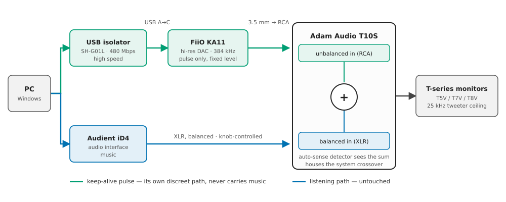
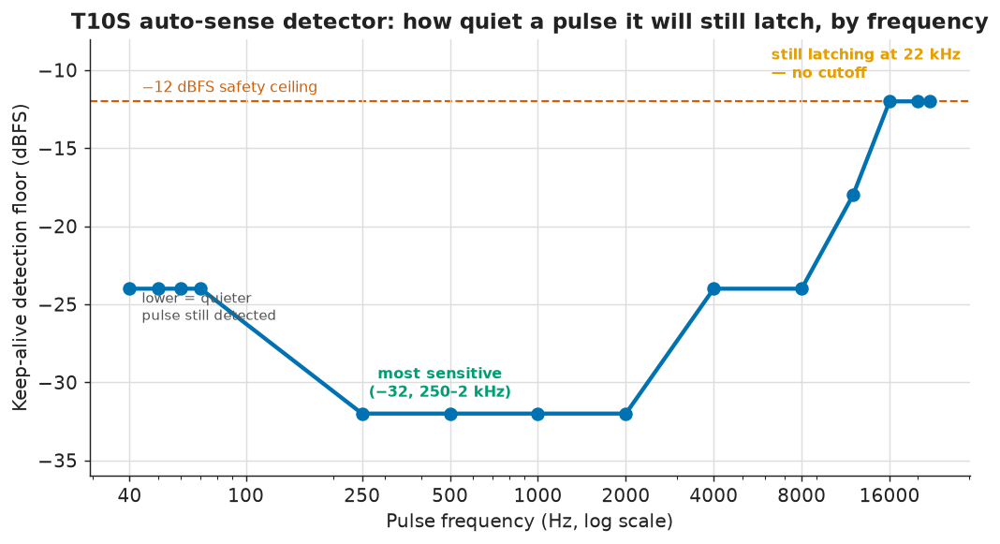
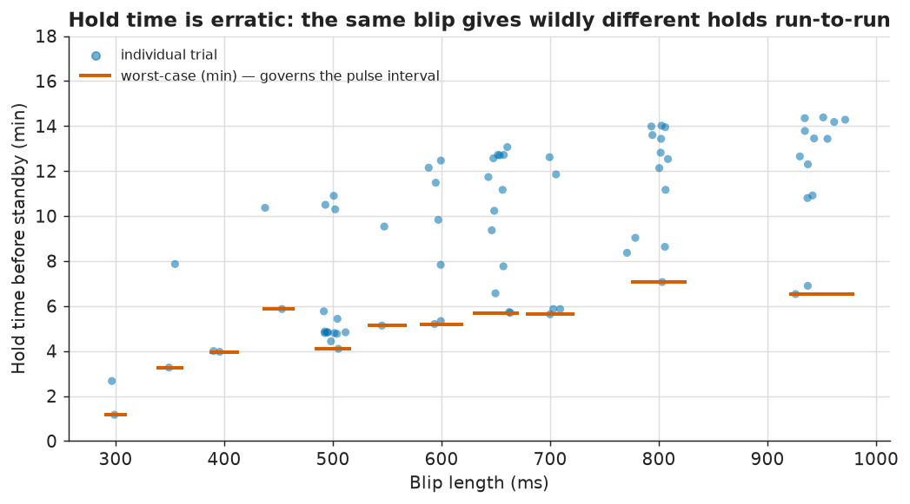
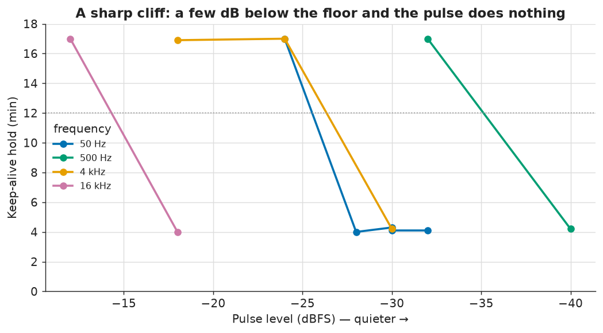
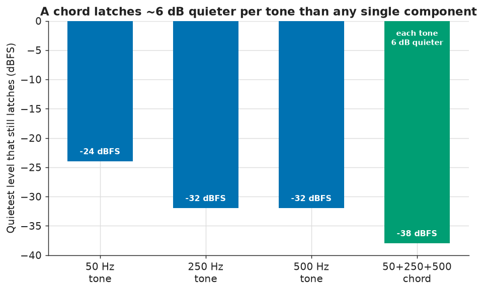

# Reverse-engineering the Adam Audio T10S standby detector

The Adam Audio T10S subwoofer drops into auto-standby after roughly 16 minutes without a detected
signal, and Adam Audio confirm the behaviour **cannot be disabled** — there is no menu option and no
switch. Because the T10S houses the crossover for the system, standby doesn't just silence the sub;
it takes the T-series monitors with it. Coming back takes several seconds and arrives with an
audible pop. Adam Audio's only guidance is to run the input hot.

## The opportunity: the sub has two inputs, and it sums them

The T10S accepts both **balanced (XLR)** and **unbalanced (RCA)** input, and it **sums whatever
arrives on both**. This project assumes the arrangement most T-series owners already have: the
primary listening path runs into the balanced inputs, which leaves the unbalanced pair unused.

That idle input pair is the whole basis of the design. A keep-alive pulse injected on RCA is summed
into the sub exactly like program material — the detector sees it and the standby timer re-arms —
while the balanced listening path is never touched. The pulse rides its own channel end to end, at
its own fixed level, independent of the monitor volume knob. Calibrate it once and it stays valid at
any listening level, including none.

The design question, then, is what that pulse should be: quiet enough to never intrude on the room,
substantial enough that the sub reliably notices. Answering it meant working out what the T10S
auto-sense detector actually responds to, which is what the rest of this document covers.

**Where it ended up:** a **30 kHz ultrasonic pulse**. The sub detects it, but it sits above what the
speakers can physically reproduce, so it is silent by physics rather than by being quiet. It has
been running in production since, holding the sub awake indefinitely.

All raw data is in [`../test-and-learn/*.csv`](../test-and-learn); the charts below regenerate from
it via [`../scripts/make_charts.py`](../scripts/make_charts.py).

## The rig

**A discreet path is required.** The pulse needs a physical output that carries nothing else.
Anything sharing a channel with program material would make the pulse level depend on the volume
knob, and a pulse calibrated at one listening level would be wrong at every other. So the pulse gets
its own USB audio device, addressed by name, that music never routes to — discreet from the PC all
the way to the sub's input.



**The first dongle, and its ceiling.** The original device was a generic USB 2.0 audio dongle —
the brand is irrelevant, and that is rather the point. What mattered was the one specification
nobody checks when buying a $10 dongle: its native sample rate. It ran 44.1/48 kHz natively in both
shared *and* exclusive mode, capping anything it could emit at 24 kHz. Worth noting the trap, since
it cost time: Windows cheerfully reported 384 kHz among the device's supported configurations, but
that figure describes the shared engine resampling on the way in, not what the hardware clocks out.
Only a direct probe of the exclusive-mode formats revealed the real limit.

**The ground loop, and why the isolator is the part that matters.** Connecting the dongle to the
sub's RCA input introduced audible static on the monitors. It persisted with the dongle muted and at
zero volume, was independent of USB activity and of which port was used, fluctuated on its own, and
vanished the instant the dongle was unplugged — a textbook ground loop between the PC chassis and
the sub, riding in on the unbalanced connection.

The fix is a galvanic USB isolator, and the specific choice turned out to matter twice over. The
installed unit is a **DSD TECH SH-G01L, 480 Mbps high speed** (ADuM4166-class), deliberately not the
common full-speed ADuM3160. High speed passes a USB Audio Class 2.0 hi-res DAC at 96/192 kHz
unthrottled while still breaking the ground connection. It was bought to solve hum; it is the reason
the ultrasonic path was possible at all later on.

The tempting alternative — an inline RCA/audio transformer isolator — would have been fatal.
Those roll off below ~50 Hz and above ~20 kHz, which is to say they attenuate precisely the two
bands this investigation was going to care about. A low-frequency pulse and an ultrasonic pulse
would both have died in the isolator, and the failure would have looked like a detector result.

**A hard level cap.** The dongle's Windows volume is pinned at 25%. At 100%, a −20 dBFS pulse shook
the house — these devices can drive the sub far harder than the application needs. 25% is a
permanent setup value, backed in the app by a −12 dBFS clamp in code.

## Reading the answer off the LED

From outside the box, the detector's state is observable exactly one way: the sub's POWER LED, green
for awake and red for standby. So the harness is a **Logitech C922 webcam pointed at that LED**.
[`led_watcher.py`](../test-and-learn/led_watcher.py) reads an HSV region of interest through OpenCV,
fires calibrated pulses via a small Rust CLI, and times how long the sub stays awake. It runs
unattended and recovers from USB and camera hiccups on its own, which is what made hundreds of
trials practical rather than theoretical.

One methodology point is worth stating explicitly, because getting it wrong invalidates everything
downstream. The obvious experiment is to measure what *wakes a sleeping sub* — but the application
never wakes anything. It keeps an already-awake sub awake, and because of hysteresis the keep-alive
threshold sits well below the wake threshold. The two numbers are not interchangeable.

The decisive test is therefore the **coast method**: wake the sub, coast to just under the standby
deadline, fire a single candidate pulse, and time the resulting hold. About 4 minutes means the
candidate did nothing and the sub simply slept on its own schedule. Fifteen to twenty minutes means
it re-armed the timer. The two outcomes are far enough apart that they cannot be confused.

## What the detector responds to

The first real question was the shape of the detector's sensitivity across frequency: at each
frequency, how quiet a pulse will it still latch onto?



There is a **subsonic high-pass** — 25 Hz is not detected at any level, placing the corner somewhere
between 25 and 50 Hz. Sensitivity peaks at **−32 dBFS between 250 Hz and 2 kHz**, then rolls off at
roughly 6 dB/octave.

The initial working assumption had been that the answer lay just above the detector's subsonic
corner and below the 80 Hz crossover — a narrow window of roughly 35–80 Hz. The sweep was extended
across the full audible range anyway, on the principle that the detector's behaviour at the
extremes was cheap to measure and entirely unknown.

That decision produced the result the project turns on. Above ~12 kHz the detection floor
**plateaus at −12 dBFS and keeps latching all the way to 22 kHz, with no cutoff in sight**. And
22 kHz was not a property of the detector — it was the Nyquist ceiling of the 48 kHz dongle. The
measurement had run out of instrument, not out of detector. A device still responding at 22 kHz with
no sign of rolling off could reasonably be expected to respond at 26–30 kHz as well, and that
possibility was worth far more than anything in the 35–80 Hz window.

## Why single measurements are untrustworthy here

The same pulse length produces markedly different hold times run to run, because near the detection
knee the outcome is decided by circuit noise:



Reliability is therefore governed by the **shortest** hold observed, not the median or the mean. It
is why the application pulses on an interval comfortably below the worst case, and why every result
here that mattered was repeated rather than measured once. An early version of this campaign drew
conclusions from single samples in this region; they did not survive contact with a larger n.

## A sharp level threshold, and a dead end below 80 Hz

Hold time against pulse level, at four representative frequencies:



Detection is close to binary. A few dB below the floor and the pulse accomplishes nothing at all;
there is no graceful degradation to trade against.

Which produced the inconvenient result. At 40–70 Hz the reliable detection floor is **−24 dBFS**,
and −24 dBFS at those frequencies is audible — or more precisely, felt. The level at which it stops
being perceptible, established by ear, is around −45 dBFS. That is an 18 dB gap with nothing in it.
**There is no inaudible low-frequency pure tone that this sub will detect.** The window everyone
assumes is the right one is, for this hardware, empty. That negative result is what redirected the
search toward chords, and ultimately upward in frequency.

## Chords latch quieter than any single tone

Summing several tones into one pulse engages the detector's response to combined energy rather than
to any single component, which lets each component sit about 6 dB quieter than it could manage
alone:



A 50 + 250 + 500 Hz chord latches reliably at **−38 dBFS per tone**, against −24 and −32 for those
same components individually, and holds down to a 0.5 s pulse. Decaying "chime" variants, shaped
with a bell-like envelope, hold at −32 dBFS. Both are substantially more discreet than a lone tone,
and both remain the recommended fallback for anyone without a hi-res DAC.

## Above what the speakers can reproduce

The obvious reading of the high-frequency plateau is "go beyond human hearing" — put the pulse above
~20 kHz and the problem solves itself. That reasoning is incomplete, and the distinction is the most
important one in this document.

Human hearing is not the only hearing in the room. Dogs hear to roughly 45 kHz. A 20–22 kHz pulse
would be genuinely inaudible to the people present while sitting squarely inside a dog's range,
several times a day, indefinitely — an outcome that is worse for being undetectable to the person
who configured it.

The correct threshold is not what people can hear but **what the speakers can physically
reproduce**. The T5V, T7V and T8V all use the same U-ART tweeter, and all cap at 25 kHz (−6 dB).
Drive a 30 kHz signal into that system and the driver simply does not radiate it. The pulse never
becomes sound in the room at all, so there is nothing present for anyone to hear — human, dog, or
otherwise. It is silent by physics rather than by being quiet, and that property holds at any level.

This is what the 48 kHz dongle had been blocking. Emitting 30 kHz requires an endpoint clocking at
least 96 kHz, so the path was upgraded to a **FiiO KA11** hi-res USB DAC, which the high-speed
isolator was already capable of passing. The KA11 defaults to **384 kHz in shared mode** — Nyquist
192 kHz — with plenty of headroom for a 30 kHz tone. That looked like the end of the matter. It
wasn't: see [the sample rate is not yours to keep](#the-sample-rate-is-not-yours-to-keep).

The prediction held:

| Test | Result |
|---|---|
| Wake a sleeping sub, 30 kHz / −12 dBFS / 1 s | **woke in 3.0 s** — unambiguously detected |
| Audible or felt in the room, at the −12 dBFS clamp maximum | **nothing** — confirmed by ear, repeatedly |
| Keep-alive hold, 2 s pulse (coast method) | **16.3 min** — re-arms the full timer |
| Keep-alive hold, 5 s pulse (coast method) | **16.8 min** — re-arms the full timer |
| Endurance, 5 s every 12 min, silent room | **passed** — consecutive deadlines survived, never slept |

These runs also pinned down **the standby timer itself**. Timed from the *last signal* rather than
from the wake, three independent measurements gave 15.85, 16.3 and 16.8 minutes, which is where the
**~16 minutes** quoted throughout this document comes from.

## The sample rate is not yours to keep

A pulse that depends on the endpoint running at 384 kHz inherits a dependency on a setting the
application does not own. Windows will change it — a driver update, an "enhancements" toggle, or
simply somebody opening Sound settings and picking 16-bit 44.1 kHz, which is exactly how this got
noticed.

The consequence is quiet and total. At 44.1 kHz, Nyquist is 22 kHz, so a 30 kHz tone cannot exist;
it folds down to an audible 14 kHz instead. Refusing to emit is the only defensible behaviour, and
the code does refuse — but a keep-alive that refuses is a keep-alive that has stopped, and the sub
sleeps a quarter of an hour later.

The obvious repair is to put the format back. Windows exposes the endpoint's default format as a
property, `PKEY_AudioEngine_DeviceFormat`, and it is writable. **It does not work.** `SetValue` and
`Commit` both return success, and the audio engine goes on using the old format: the property is
only consulted when the endpoint is re-initialised, which is why the utilities that do change it
disable and re-enable the device afterwards. Measured here, the write reported success on every
20-second cycle for minutes on end while the device sat unmoved at 44.1 kHz.

That failure is worth dwelling on, because the first implementation *believed* the return value and
logged a cheerful "repaired" each time. An unverified success is worse than a failure: it converts a
dead keep-alive into a healthy-looking one. The fix is to read the device back and report what is
actually true — and the same principle applies to any repair that goes through an API which can
accept an instruction without carrying it out.

The real answer is not to depend on the shared format at all. **WASAPI exclusive mode** negotiates
the sample rate directly with the driver, bypassing whatever the shared "Default Format" says. Given
a device dedicated to this one job, taking exclusive control of it for the few seconds of a pulse
costs nothing — and the objection that would normally rule it out, that exclusive mode locks other
software out of the device, is precisely the thing a dedicated channel makes irrelevant. The pulse
now goes out in exclusive mode at 384 kHz, and the endpoint's shared setting can be anything at all.
Verified by leaving the device at 44.1 kHz and watching the pulse fire regardless — inaudibly.

## The failure the LED harness could not see

The harness measures one thing — whether the sub stays awake. It is completely blind to *what the
pulse sounds like*, and it duly certified a pulse that had become audible.

At 5 s, the supposedly silent 30 kHz pulse developed a faint modem-like warble. Nothing was wrong
with the frequency, the level, or the hardware. The synthesis was computing phase from the absolute
sample index in 32-bit float:

```rust
s += (2.0 * PI * f * (n as f32) / sr).sin();   // n grows to ~1.92 M at 384 kHz × 5 s
```

By the end of the pulse the phase argument reaches ~9.4×10⁵ radians, where a single f32 ulp is
~0.06 rad against a per-sample step of 0.49 rad. The resulting phase jitter smears the carrier into
broadband hash: **−56 dB of audible-band energy**, peaking near 8 kHz. The effect is
duration-dependent — at 1 s the same artifact sits at −66 dB, which is why the original one-second
audition was genuinely clean while the five-second production pulse was not. Computing phase in f64
puts it below **−160 dB**.

Two lessons outlast the fix. **Instrumentation measures what it measures**: every hold time recorded
in this document remained valid, because the detector does not care about spectral purity — the
automation simply had no channel for the one failure mode that mattered. And **an ultrasonic carrier
hides none of its own distortion**: the artifact was audible precisely *because* the intended signal
was not, leaving nothing to mask it.

## Where it lands

The keep-alive is a **30 kHz ultrasonic pulse at −12 dBFS for 5 s, every 12 minutes**, on a
dedicated DAC feeding the sub's unbalanced input.

- **No inaudible low-frequency tone exists** for this sub. That negative result is what forced the
  search upward in the first place, and it is the finding most likely to save someone else time.
- **The relevant ceiling is the speakers', not the listener's.** Above 25 kHz the system cannot
  radiate the pulse at all, which is a stronger guarantee than inaudibility and extends to pets.
- **Audible but unobtrusive fallbacks**, where a hi-res DAC isn't available: chords at −38 dBFS per
  tone, or soft chimes at −32 dBFS.
- **The ultrasonic pulse is not a compromise between the two axes — it escapes them.** Because it is
  inaudible by physics rather than by being quiet, it can run at the maximum level the safety clamp
  allows and it can run long. Duration and cadence stop trading against audibility, which is what
  buys a comfortable margin under a ~16 minute timer.
- **Requires** a DAC natively clocking ≥ 96 kHz, a high-speed isolator if one is in the path, and
  code that refuses to emit at or above Nyquist. At a 48 kHz endpoint, 30 kHz folds down to a very
  audible 18 kHz.
- **Emit in exclusive mode.** It is the only way to stop depending on a Windows setting that the
  application cannot reliably restore, and a dedicated device makes the usual objection moot.

Every pulse is a clean sine, or sum of sines, with raised-cosine fades, hard-capped at −12 dBFS with
the dongle pinned to 25% volume. The sub is never driven hard.
